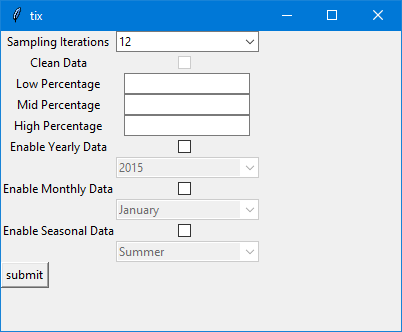

# Load Duration Curve Tool

This tool provides the ability to generate both load duration curves and load profile for a given circuit breaker 

## FAQ

#### What files do i need?

the following (in order of request) are the data files you will need to run the code:
- An CSV file with the data extracted from SCADA
- An excel file with the Regional Capacity Capability
- An excel file where the output can be exported (original content will be deleted)
you will aslo need to specify a folder/filepath where the output images can be saved.

#### What do i input for itterations?

the itterations variable refers to the itterations per hour, a variable of 12 would mean that there are 12 itterations within a 60 minute period. 12 itterations relates to a dataset of 5 minute data
## Installation

Required Modules
-  [pandas](http://pandas.pydata.org/)
-  [numpy](http://numpy.org)
-  [matpotlib](http://matplotlib.org/)
-  [tkinter](https://docs.python.org/3/library/tkinter.html#module-tkinter)
-  [time](https://docs.python.org/3/library/time.html)
-  [datetime](https://docs.python.org/3/library/datetime.html)

## Application User Interface

## Acknowledgements

 - [Plotting a Load-Duration Curve with Python](https://blog.finxter.com/plotting-a-load-duration-curve-with-python/)
