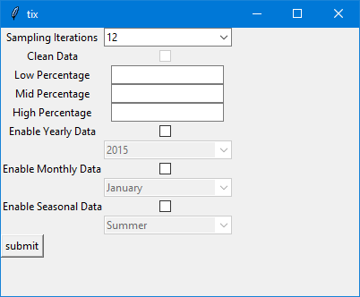

# Load Duration Curve Tool

This tool provides the ability to generate both load duration curves and load profile for a given circuit breaker 

## FAQ

#### What do i input for itterations?

the itterations variable refers to the itterations per hour, a variable of 12 would mean that there are 12 itterations within a 60 minute period. 12 itterations relates to a dataset of 5 minute data

#### Question 2

Answer 2

## Screenshots

