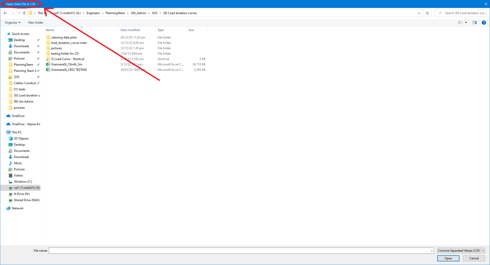

# Load Duration Curve Tool

The load duration curve is a vital tool that plays a significant role in the analysis and planning of electric utility operations. It is a graphical representation of the frequency of the electricity load (or demand) over a specific period of time, typically a year. The curve provides a clear picture of the pattern of electricity usage and is used to determine the peak demand times, average energy consumption, and energy requirements during off-peak hours. This information is crucial in ensuring efficient operation of the power system and in making informed decisions about future power infrastructure investments. The load duration curve is widely used by electric utilities for resource planning, system design, and capacity expansion planning, among other things.

## Functionality 

This tool provides the ability to generate both load duration curves and load profile for a given load. You are required to input three files and a folder location (load data, regional capacity and output sheet). 

The load duration curve helps determine seasonal patterns of electricity demand, enabling the best time for maintenance or installations. It can be adjusted by season, year, and month, providing a comprehensive understanding of demand patterns. 

The "clean data" function requires further development to meet the manual cleaning standards. However, the automatic correction of zero values is currently in place. By improving the accuracy and efficiency of the "clean data" function, the quality and reliability of the data used for analysis and decision making will be ensured.

The user has the option to input low, middle, and high demand test points, providing flexibility in analyzing electricity demand patterns. This allows for a more detailed understanding of the electricity usage and provides a more accurate representation of the demand.

## Output (example)

The output file that is gernerated is in the following format, with 11 coloumns and as many rows as loads in the dataset.

|     Feeder     |  Limit | Percentage Over   Limit (%) | Time Over Limit   (hrs) |  low  |  mid  |  high |   Max  |  Min  |                                     Dates Over Limit                                    | Magnitude over   limit |
|:--------------:|:------:|:---------------------------:|:-----------------------:|:-----:|:-----:|:-----:|:------:|:-----:|:---------------------------------------------------------------------------------------:|:----------------------:|
| GRM_CB9_A_Amps | 115.00 | 0.57                        | 59.39                   | 64.27 | 61.80 | 59.69 | 131.62 | 34.84 | ['August 2019', 'September 2019', 'March 2020'] | 16.62                  |

The first image that is saved is the load profile. This is the graphical representation of the load useage over a period of time. It can be used to show trends and patterns of comsumption, with a limit also shown to identify if the load exceds the limit. 

the second image is the load durration curve. In addtion to the load durration curve the limit, percentage at whitch limit is exceded (if exceded), and testpoint percentages (if selected) are also displayed. 

## FAQ

#### What files do i need?

the following (in order of request) are the data files you will need to run the code:
- An CSV file with the data extracted from SCADA
- An excel file with the Regional Capacity Capability
- An excel file where the output can be exported (original content will be deleted)
you will aslo need to specify a folder/filepath where the output images can be saved.

#### What do i input for itterations?

The "iterations" variable represents the sampling rate, where a value of 12 means the data is sampled 12 times per hour, yielding 5-minute data intervals. The sampling rate affects data accuracy, with a higher rate leading to more detailed analysis of electricity demand patterns. The ability to adjust the sampling rate provides flexibility in data collection and analysis.
## Installation

Required Modules
-  [pandas](http://pandas.pydata.org/) (used for its dataframe object) 
-  [numpy](http://numpy.org) (general mathematical functions)
-  [matpotlib](http://matplotlib.org/) (used to plot the end result) 
-  [tkinter](https://docs.python.org/3/library/tkinter.html#module-tkinter) (used to create pop out windows for user inputs)
-  [time](https://docs.python.org/3/library/time.html) (used to record the time taken for the program to run)
-  [datetime](https://docs.python.org/3/library/datetime.html) (used to interpret and minipulate the dataset)

## Application User Interface

When running the application you are greated with a user interface. The way the tool is configured, you are not required to input anything and the preset sampling is for 5 minuite data. Persentage testpoints and data minuipulation are not required to run the program. data minipulation is disabled unless one is secelected and multiple can bee selected such as Summer in 2021 or January in 2019, howerver the dates selected must exist within the data file otherwise errors will occur. 

after submitting the initail perameters you are greated with several pop out windows that request you to select the required files/folders. The red indicator shows what file to select, in this case the request is to open a .csv data file. 

## Acknowledgements

 - [Plotting a Load-Duration Curve with Python](https://blog.finxter.com/plotting-a-load-duration-curve-with-python/)
